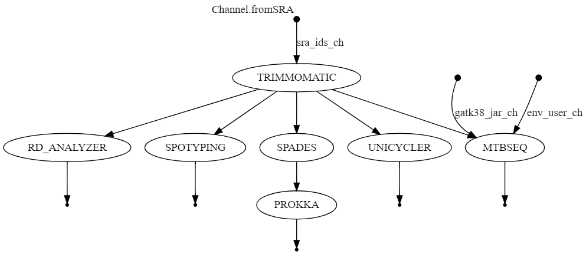

# bahia-analysis nextflow pipeline

a pipeline for assemblying, anotating _Mycobacterium Tuberculosis_ genomes and function prediction of antibiotic resistance that takes sra ids and handles the fastqs as inputs. it also integrates [rd analyzer](https://github.com/xiaeryu/RD-Analyzer) as a tool.
## Requirements for local launch:

* Nextflow VERSION > 20.11
* Java 8
* Docker

## Pipeline workflow



This is the complete workflow of this pipeline.

## Quick start

### Local execution
1. Install nextflow 

	Please refer to [Nextflow page on github](https://github.com/nextflow-io/nextflow/) for more info.

2. Run it!

```
	nextflow run https://github.com/bioinformatics-lab/rita_bahia_analysis.git -params-file params/YOUR_PARAMS_FILE

```

$YOUR_PARAMS_FILE = FILE NAME, replace for your params file location, please refere to params_stardard.yml as template.


## Configuration Profiles.

You can use diferent profiles for this pipeline, based on the computation enviroment at your disposal. Here are the Avaliable Profiles:

* aws 

* gls

* azureBatch

* awsBatch

`Note: Update conf/profile with your own credentials`

## Tower execution
This Pipeline can be launched on `Tower`, please refer to [Tower launch documentation](https://help.tower.nf/docs/launch/overview/) for step-by-step execution tutorial.

When launching from `Tower`, please update and use the `params.yml` file contents.

## stub-run
This project has the `-stub-run` feature, that can be used for testing propouse, it can be used on `Tower` with the Advanced settings on launch. You can also test it locally, using the following command:

```
bash data/mock_data/generate_mock_data.sh
nextflow run main.nf \
		 -params-file params/stub_params.yaml \
		 -stub-run
``` 

## NOTE
Problematic samples:
- ERR1035303
- ERR1035365
